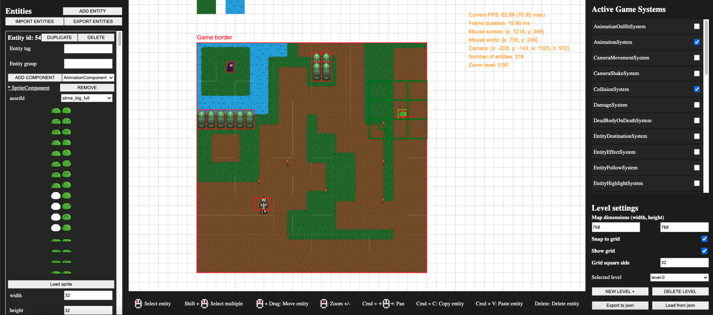
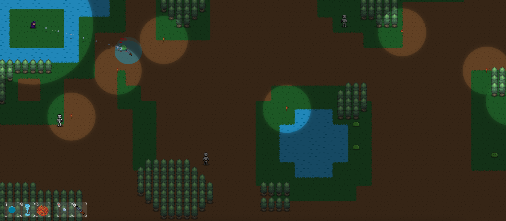

# Blob Slash

A JavaScript game engine for the browser. Built around an Entity Component System (ECS) architecture.

This project expands on the [JS 2D ECS Game Engine](https://github.com/samdalvai/js-2d-ecs-game-engine) by introducing:

- An **editor mode** for designing and managing game levels.
- Additional **game systems and mechanics**.

# Getting Started

## Prerequisites

- Node.js installed on your machine.

## Install dependencies

```
npm install
```

## Run in game mode

```
npm start
```

## Run in editor mode

```
npm run start:editor
```

## Clean build files

You may need to clean the build files when switching between game mode and editor mode:

```
npm run clean
```

# Editor Features



The editor provides tools to design and manage entities, components, and levels:

- Entity management

    - Entity creation
    - Adding, editing, or removing components on entities
    - Editing entities' tags and groups

- Map editing

    - Move entities on the map (with optional grid snapping)
    - Copy/Cut/Paste entities
    - Undo/Redo changes

- Import / Export

    - Export/Import entities to/from json files
    - Import/Export levels to/from json files

- Other Utilities
    - Test game systems
    - Load entity sprites
    - Save levels to the browser's local storage

# Game example

A demonstration RPG-style 2D game built with this engine, where the player can cast spells and defeat enemies. Sprites have been created using [Piskel](https://www.piskelapp.com/p/create/sprite/).



# Project structure

```text
/src

    /__tests__
        /editor             -> Unit tests for editor related logic
        /engine             -> Unit tests for engine related logic
        /game               -> Unit tests for game related logic

    /editor
        /entity-editor      -> Level and entity management with HTML elements logic
        /events             -> Editor events (entity delete, entity paste, etc.)
        /gui                -> HTML gui utilities
        /persistence        -> Handling of levels storage and loading
        /systems            -> Editor systems (entity drag, sidebar rendering, etc.)
        /types              -> Editor related types
        /version-manager    -> Handling of undo/redo and level versions

    /engine
        /asset-store        -> Asset loading and retrieval (sprites, sounds, etc.)
        /config             -> Configuration for assets loading in Javascript modules
        /ecs                -> Logic for entity/components/systems architecture
        /event-bus          -> Handling of game events
        /input-manager      -> Handling of game inputs (mouse, keyboard)
        /level-manager      -> Loading and initialization of levels
        /loop-strategy      -> Definition of engine loop logic (fixed or default)
        /serialization      -> Serialization and deserialization of levels and entities to/from json
        /types              -> Core engine types
        /utils              -> Engine utility and math-related functions

    /game
        /components         -> Entities components (sprite, transform, health, etc.)
        /events             -> Game events (collision, hit, etc.)
        /systems            -> Game systems (movement, rendering, collision, etc.)

    /spritesheets           -> Collection of game sprites with Piskel file

    /dist
        /assets             -> Game assets folder (spites, sounds, levels, etc.)


```

# How to develop a new game mechanic

If you want to develop a new game mechanic you can do so by peforming these steps

1. If needed create a new component for an entity under `src/game/components`

```JavaScript
import Component from '../../engine/ecs/Component';

export default class MyNewComponent extends Component {
    myProperty: number;

    constructor(myProperty = 0) {
        super();
        this.myProperty = myProperty;
    }
}
```

2. Add your new component to the list of exported Game components under `src/game/components/index.ts`. This is needed to have the component available when in editor mode

```JavaScript
// ... other imports
export { default as TextLabelComponent } from '../../game/components/TextLabelComponent';
export { default as TransformComponent } from '../../game/components/TransformComponent';
export { default as MyNewComponent } from '../../game/components/MyNewComponent'; // Export your new component
```

3. Create a new system under `src/game/systems`

```JavaScript
import MyNewComponent from '../components/MyNewComponent';
import System from '../../engine/ecs/System';

export default class MyNewSystem extends System {
    constructor() {
        super();
        this.requireComponent(MyNewComponent); // Require entities to have your component
        // Optionally add other required components
    }

    update() {
        for (const entity of this.getSystemEntities()) {
            const myComponent = entity.getComponent(MyNewComponent);

            myComponent.myProperty += 1; // Apply your system logic
        }
    }
}
```

4. Add your new system to the list of exported Game systems under `src/game/systems/index.ts`. This is needed to have the system available when in editor mode

```JavaScript
// ... other imports
export { default as RenderSystem } from './RenderSystem';
export { default as RenderTextSystem } from './RenderTextSystem';
export { default as MyNewSystem } from '../../game/components/MyNewSystem'; // Export your new system
```

5. Register your system in `src/game/Game.ts:setup()`

```JavaScript
setup = async () => {
    // ... other registered systems
    this.registry.addSystem(Systems.MovementSystem);
    this.registry.addSystem(Systems.AnimationSystem);
    this.registry.addSystem(Systems.MyNewSystem); // Register you new system
}
```

6. Perform you update logic in `src/game/Game.ts:update()` or `src/game/Game.ts:render()`, depending on the type of system, e.g. if a system needs to perform rendering you will add it in the `render()` function.

```JavaScript
update = (deltaTime: number) => {
    // ... other systems updates
    this.registry.getSystem(Systems.MovementSystem)?.update(deltaTime);
    this.registry.getSystem(Systems.AnimationSystem)?.update();
    this.registry.getSystem(Systems.SpriteStateSystem)?.update(); // Perfom update for you new system
};
```

# License

This project is licensed under the [MIT License](LICENSE).
