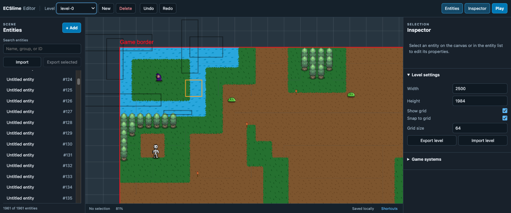
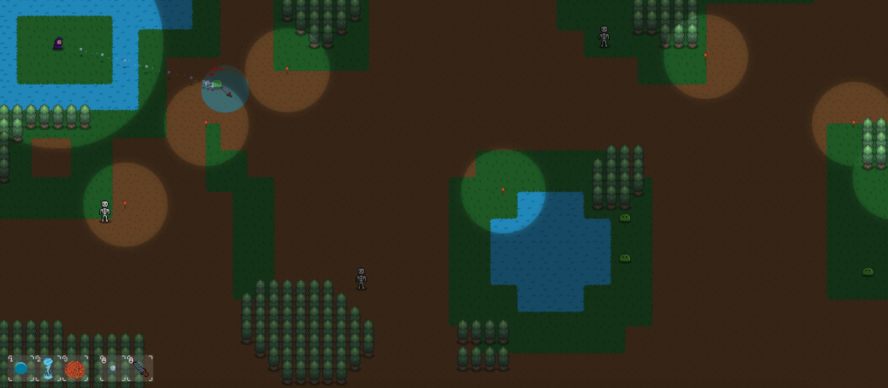

# ECSlime Engine

A JavaScript game engine for the browser. Built around an Entity Component System (ECS) architecture.

This project expands on the [JS 2D ECS Game Engine](https://github.com/samdalvai/js-2d-ecs-game-engine) by introducing:

- An **editor mode** for designing and managing game levels.
- Additional **game systems and mechanics**.

# Getting Started

## Prerequisites

- Node.js installed on your machine.

## Install dependencies

```
npm install
```

## Run the demo apps

```sh
npm run start:rpg-game      # RPG game
npm run start:rpg-editor    # RPG editor
npm run start:physics-game  # Physics game
```

These commands build the engine library in `lib/`, watch engine and gravity.js changes, and serve the selected app. The RPG game runs at `http://localhost:1234`, the editor at `http://localhost:1235`, and the physics game at `http://localhost:1236`.

To build production bundles:

```sh
npm run build:rpg-game      # dist/index.html
npm run build:rpg-editor    # dist/editor.html
npm run build:physics-game  # dist/physics-game/index.html
```

Use `npm run build:package` to compile just the reusable engine. Its JavaScript and TypeScript declarations are generated in `lib/`.

## Clean build files

To remove generated files while keeping the checked-in demo assets:

```
npm run clean
```

# Editor Features



The editor provides tools to design and manage entities, components, and levels:

- Entity management

    - Entity creation
    - Adding, editing, or removing components on entities
    - Editing entities' tags and groups

- Map editing

    - Move entities on the map (with optional grid snapping)
    - Copy/Cut/Paste entities
    - Undo/Redo changes

- Import / Export

    - Export/Import entities to/from json files
    - Export/Import levels to/from json files

- Other Utilities
    - Test game systems
    - Load entity sprites
    - Persist levels to the browser's local storage

# Game example

A demonstration RPG-style 2D game built with this engine, where the player can cast spells and defeat enemies. Sprites have been created using [Piskel](https://www.piskelapp.com/p/create/sprite/). You can find a working demo of this game at this [link](https://samdalvai.github.io/ecslime-engine/).



# Project structure

```text
src/                    -> Reusable engine source and public API (index.ts)
lib/                    -> Generated engine library (ignored by Git)
apps/
    rpg-game/           -> Example game, HTML/CSS, components, events, and systems
    rpg-editor/         -> Editor HTML/CSS and source for the example game
    physics-game/       -> Physics demo HTML/CSS and source
__tests__/
    src/                -> Tests for the engine, mirroring src/
    apps/
        rpg-game/       -> Tests for the example game
        rpg-editor/     -> Tests for the editor
spritesheets/           -> Game sprite sources
dist/assets/            -> Game assets
```

# Engine API

The reusable engine code lives under `src` and is exported through `src/index.ts`. `npm run build:package` compiles it into `lib/`. Both apps import the compiled library through the package's public API, regardless of the importing file's location:

```ts
import { Engine, RAFLoopStrategy, Component } from 'ecslime-engine';
```

Engine unit tests import `src/` directly. App tests import `ecslime-engine`, so they use the same engine instance as the apps. The test command builds the package first.

`src` should not import from `apps/rpg-game` or `apps/rpg-editor`. App-specific components are provided to engine serialization and duplication through the game component catalog.

# Game Component Catalog

Serializable game components are exposed through `apps/rpg-game/catalog/gameComponentCatalog.ts`. The catalog is built from the exports in `apps/rpg-game/components/index.ts` and is passed to engine APIs that need to resolve component names, such as deserialization and entity duplication.

When adding a component, export it from `apps/rpg-game/components/index.ts`; that makes it available to the editor and the `gameComponentCatalog`.

# How to develop a new game mechanic

If you want to develop a new game mechanic you can do so by performing these steps.

1. If needed create a new component for an entity under `apps/rpg-game/components`

```ts
import { Component } from 'ecslime-engine';

export default class MyNewComponent extends Component {
    myProperty: number;

    constructor(myProperty = 0) {
        super();
        this.myProperty = myProperty;
    }
}
```

2. Add your new component to the list of exported game components under `apps/rpg-game/components/index.ts`. This also makes the component available through `gameComponentCatalog`.

```ts
// ... other imports
export { default as TextLabelComponent } from './TextLabelComponent';
export { default as TransformComponent } from './TransformComponent';
export { default as MyNewComponent } from './MyNewComponent';
```

3. Create a new system under `apps/rpg-game/systems`

```ts
import { System } from 'ecslime-engine';
import MyNewComponent from '../components/MyNewComponent';

export default class MyNewSystem extends System {
    constructor() {
        super();
        this.requireComponent(MyNewComponent); // Require entities to have your component
        // Optionally add other required components
    }

    update() {
        for (const entity of this.getSystemEntities()) {
            const myComponent = entity.getComponent(MyNewComponent);

            myComponent.myProperty += 1; // Apply your system logic
        }
    }
}
```

4. Add your new system to the list of exported game systems under `apps/rpg-game/systems/index.ts`. This is needed to have the system available when in editor mode.

```ts
// ... other imports
export { default as RenderSystem } from './RenderSystem';
export { default as RenderTextSystem } from './RenderTextSystem';
export { default as MyNewSystem } from './MyNewSystem';
```

5. Register your system in `apps/rpg-game/Game.ts:setup()`

```ts
setup = async () => {
    // ... other registered systems
    this.registry.addSystem(Systems.MovementSystem);
    this.registry.addSystem(Systems.AnimationSystem);
    this.registry.addSystem(Systems.MyNewSystem); // Register you new system
}
```

6. Perform your update logic in `apps/rpg-game/Game.ts:update()` or `apps/rpg-game/Game.ts:render()`, depending on the type of system. For example, if a system needs to perform rendering, add it in the `render()` function.

```ts
update = (deltaTime: number) => {
    // ... other systems updates
    this.registry.getSystem(Systems.MovementSystem).update(deltaTime);
    this.registry.getSystem(Systems.AnimationSystem).update();
    this.registry.getSystem(Systems.MyNewSystem).update();
};
```

# License

This project is licensed under the [MIT License](LICENSE).
